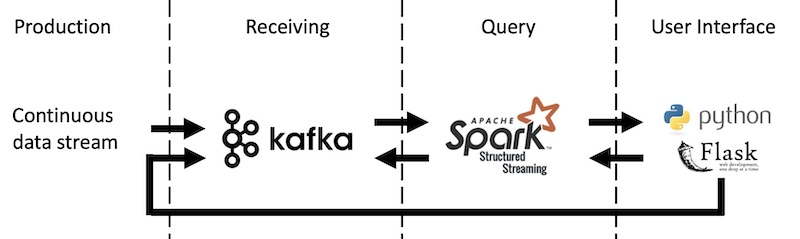

<!-- /Users/aptroost/Repositories/kafka-spark-structured-streaming -->
# Near real-time stream processing pipeline
This is a simple 'real-time' stream processing pipeline using Docker, Kafka, Spark 3.0, Python and Flask.

The dataset that will be used is from [OpenFlights](https://raw.githubusercontent.com/jpatokal/openflights/master/data/routes.dat) . The documentation for this data can be found [here](https://openflights.org/data.html).

The Dockerfiles used are based on [this](https://github.com/Wesley-Bos/spark3.0-examples) repository.


## Methodology

1. Production: Data are created over time. In this example we use the data file stored in `data/routes.dat` that will simulate a continuous stream of data.
2. Receiving: The produced data are sent to Kafka, where they will be collected continuously over time.
3. Query: With Spark Structured Streaming the dataset in Kafka can be queried with the most recent produced data.
4. User Interface:
- In this method it is chosen that data are produced using Flask and egressed towards Kafka to simulate a continuous data stream.
- Using a Flask route, Spark queries can be triggered and presented on a web page in JSON format. These results are stored in CSV format in `results/*.csv`.




## Setup
Kafka runs its own Confluent environment with a broker that can be accessed on an exposed port.

Spark runs in a separate container, where the Flask application runs in as well. Flask can then be accessed using the exposed port and use Spark installed in that container. Spark can then access Kafka running in a separate container.


## How to use

1. Launch the Kafka environment:
```
docker-compose -f ./kafka/docker-compose.yml up -d
```
2. Build Spark container with Flask app:
```
​docker build -t spark-chief -f Dockerfile .
```
3. Create common network and connect the Kafka broker:
```
docker network create kafka-net
docker network connect kafka-net broker
```
4. Run Spark container (change `<path_to_your_repo>`)
```
docker run --rm -p 5000:5000 -it -v <path_to_your_repo>/results:/opt/spark/results --name spark_chief spark-chief sh
```
5. In a separate terminal, connect the Spark container to the common network.
```
docker network connect kafka-net spark_chief
```
6. Produce data

Wait until the first terminal returns the following:
```
* Running on http://0.0.0.0:5000/ (Press CTRL+C to quit)
```

After that, go to [http://0.0.0.0:5000/produce](http://0.0.0.0:5000/produce) to initiate the data production, resulting in:
```json
{
	"data": [{
		"Total count": 67663
	}, {
		"Total count (%)": 100.0
	}, {
		"Total success": 66765
	}, {
		"Total success (%)": 98.67
	}, {
		"Total errors by var transform": 898
	}, {
		"Total errors by var transform (%)": 1.33
	}, {
		"Total errors by invalid schema": 0
	}, {
		"Total errors by invalid schema (%)": 0.0
	}],
	"error": false,
	"message": "produce",
	"statusCode": 200
}
```

7. Run different views.

[http://0.0.0.0:5000/top10_source_airport](http://0.0.0.0:5000/top10_source_airport)
```json
{
	"data": [{
		"count": 915,
		"source_airport": "ATL"
	}, {
		"count": 558,
		"source_airport": "ORD"
	}, {
		"count": 535,
		"source_airport": "PEK"
	}, {
		"count": 525,
		"source_airport": "LHR"
	}, {
		"count": 524,
		"source_airport": "CDG"
	}, {
		"count": 497,
		"source_airport": "FRA"
	}, {
		"count": 492,
		"source_airport": "LAX"
	}, {
		"count": 469,
		"source_airport": "DFW"
	}, {
		"count": 456,
		"source_airport": "JFK"
	}, {
		"count": 453,
		"source_airport": "AMS"
	}],
	"error": false,
	"message": "top10_source_airport",
	"statusCode": 200
}
```

[http://0.0.0.0:5000/top10_equipment_30min_window](http://0.0.0.0:5000/top10_equipment_30min_window)
```json
{
	"data": [{
		"count": 5142,
		"end": "2021-05-04 09:59:00",
		"equipment": "738",
		"start": "2021-05-04 09:58:30"
	}, {
		"count": 4870,
		"end": "2021-05-04 09:59:00",
		"equipment": "320",
		"start": "2021-05-04 09:58:30"
	}, {
		"count": 4245,
		"end": "2021-05-04 09:59:30",
		"equipment": "320",
		"start": "2021-05-04 09:59:00"
	}, {
		"count": 1974,
		"end": "2021-05-04 09:59:30",
		"equipment": "738",
		"start": "2021-05-04 09:59:00"
	}, {
		"count": 1795,
		"end": "2021-05-04 09:59:00",
		"equipment": "319",
		"start": "2021-05-04 09:58:30"
	}, {
		"count": 1611,
		"end": "2021-05-04 09:59:30",
		"equipment": "319",
		"start": "2021-05-04 09:59:00"
	}, {
		"count": 1296,
		"end": "2021-05-04 09:59:30",
		"equipment": "737",
		"start": "2021-05-04 09:59:00"
	}, {
		"count": 1077,
		"end": "2021-05-04 09:59:00",
		"equipment": "73H",
		"start": "2021-05-04 09:58:30"
	}, {
		"count": 963,
		"end": "2021-05-04 09:59:30",
		"equipment": "73H",
		"start": "2021-05-04 09:59:00"
	}, {
		"count": 903,
		"end": "2021-05-04 09:59:00",
		"equipment": "737",
		"start": "2021-05-04 09:58:30"
	}],
	"error": false,
	"message": "top10_equipment_30min_window",
	"statusCode": 200
}
```

[http://0.0.0.0:5000/dump_table](http://0.0.0.0:5000/dump_table)
```json
{
    "data": [{
        "airline": "2B",
        "airline_id": 410,
        "codeshare": false,
        "datetime": "Tue, 04 May 2021 09:58:32 GMT",
        "destination_airport": "KZN",
        "destination_airport_id": 2990,
        "equipment": "CR2",
        "id": "d89ac153-e415-472f-8fd8-785c8491395d",
        "source_airport": "AER",
        "source_airport_id": 2965,
        "stops": 0
    },
    ...
    ...
    ...
    , {
        "airline": "ZM",
        "airline_id": 19016,
        "codeshare": false,
        "datetime": "Tue, 04 May 2021 09:59:23 GMT",
        "destination_airport": "FRU",
        "destination_airport_id": 2912,
        "equipment": "734",
        "id": "040c2d3b-20ca-4db5-8ef7-4d10a7a40a00",
        "source_airport": "OSS",
        "source_airport_id": 2913,
        "stops": 0
    }],
    "error": false,
    "message": "dump_table",
    "statusCode": 200
}
```


## Addendum: Avro Schema

Below is the Avro schema stored in `data/data_schema.json` used to ingest the data before sending to Kafka.

```json
{
	"type": "record",
	"doc": "This event records routes between airports on airlines.",
	"name": "AirlineRouteEvent",
	"fields": [{
		"name": "id",
		"type": "string",
		"doc": "A universally unique identifier that is generated using random numbers"
	}, {
		"name": "datetime",
		"type": "string",
		"doc": "The produced event datetime in UTC format"
	}, {
		"name": "airline",
		"type": "string",
		"doc": "2-letter (IATA) or 3-letter (ICAO) code of the airline"
	}, {
		"name": "airline_id",
		"type": "int",
		"doc": "Unique OpenFlights identifier for airline"
	}, {
		"name": "source_airport",
		"type": "string",
		"doc": "3-letter (IATA) or 4-letter (ICAO) code of the source airport"
	}, {
		"name": "source_airport_id",
		"type": "int",
		"doc": "Unique OpenFlights identifier for source airport"
	}, {
		"name": "destination_airport",
		"type": "string",
		"doc": "3-letter (IATA) or 4-letter (ICAO) code of the destination airport"
	}, {
		"name": "destination_airport_id",
		"type": "int",
		"doc": "Unique OpenFlights identifier for destination airport"
	}, {
		"name": "codeshare",
		"type": "boolean",
		"doc": "True if this flight is a codeshare (that is, not operated by Airline, but another carrier)"
	}, {
		"name": "stops",
		"type": "int",
		"doc": "Number of stops on this flight (0 for direct)"
	}, {
		"name": "equipment",
		"type": "string",
		"doc": "3-letter codes for plane type(s) generally used on this flight, separated by spaces"
	}]
}
```
